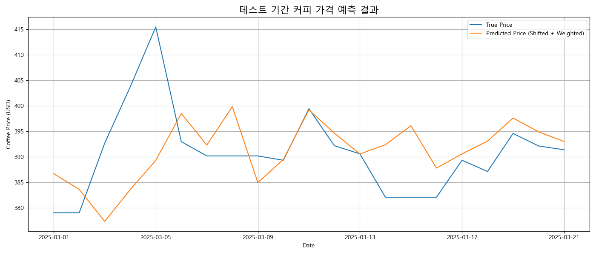

### RandomForest - Target: `Coffee_Price_Return`

| 모델 버전        | 설명                                            |
| ---------------- | ----------------------------------------------- |
| rf_return_v1.0.0 | 범주형 OneHotEncoding 후 바로 target 예측       |
| rf_return_v1.0.1 | `v1.0.0`에서 target에 로그를 씌워서 예측        |
| rf_return_v1.0.2 | `v1.0.0`에서 target을 100배 증폭시켜서 예측     |
| rf_return_v1.1.0 | `v1.0.0` 에서 month 범주형 컬럼을 추가하여 예측 |

---

### RandomForest - Target: `Coffee_Price`

| 모델 버전       | 설명                                                                                                                                                                                                                                                              |
| --------------- | ----------------------------------------------------------------------------------------------------------------------------------------------------------------------------------------------------------------------------------------------------------------- |
| rf_price_v1.0.0 | 범주형 변수에 OneHotEncoding을 적용한 후 커피 가격 자체를 예측. 커피 가격은 장기적으로 상승 추세를 보이나, RandomForest는 평균 회귀 경향이 강해 낮은 가격대 중심으로 예측됨. 따라서 테스트 구간에서는 첫날 실제 가격으로 예측값을 보정함.                         |
| rf_price_v1.0.1 | `v1.0.0` 구조를 참고하여, 예측값을 하루 늦게 예측하는 경향을 반영. test 예측 결과를 하루 shift하여 실제 시점과 맞추는 방식으로 시계열 예측 오차를 보완함.                                                                                                         |
| rf_price_v1.1.0 | `v1.0.0` 구조 기반에 선형적으로 증가하는 일별 가중치를 도입하여, 시간이 지날수록 상승하는 커피 가격 경향을 반영함. 가중치는 1년 동안 평균 증가율로 하려고 하였지만 큰 변화가 없어 급격한 변화를 감지할 수 없었음. 따라서 **`Max / Min`의 평균을 가중치**로 두었음 |
| rf_price_v1.1.1 | `v1.0.1` 구조에 선형 가중치를 결합한 확장 버전. 시간 흐름에 따른 상승 가중치(`Max / Min`의 평균)를 적용하고, 테스트 구간에서는 하루 shift 방식으로 시계열 오차를 함께 보정함.                                                                                     |

---

### 최적 모델

현재로서는 `rf_price_v1.1.1`이 커피 가격의 전반적인 흐름을 가장 잘 따라가는 모델이다. 실행 결과는 다음과 같다:

**valid 결과:**

```
📊 검증 성능 (보정 + 가중치):
RMSE : 1081.44309
R²   : 0.68602
```


가중치 덕분에 전체적인 흐름은 잘 반영되지만, 급격한 가격 변화에는 민감하게 반응하지 못한다.

RMSE는 1081.44로, 예측값이 실제값에서 평균적으로 약 1081.44만큼 차이가 나고 있다. 이는 급격한 변화를 전부 놓친 결과이다. 급격한 변화는 시간이 흐를 수록 더 많이 놓친다.

R²는 0.68602로, 전체 데이터에서 모델이 약 68.6% 정도의 분산을 설명할 수 있다는 의미이다. 이는 좋은 예측 성능을 나타내며, 데이터의 흐름을 잘 따르고 있다는 평가를 할 수 있다.

**test 결과:**

```
📊 테스트 성능 (보정 + 가중치):
Test RMSE : 89.93720
Test R²   : -0.41143
```



테스트 기간인 약 2주 동안도 전체적인 흐름은 잘 따라가지만, 급격한 변화에 대한 반응은 여전히 제한적이다.

RMSE는 89.94로, 테스트 데이터에서 예측값이 실제값과 비교하여 평균적으로 약 89.94만큼 차이가 발생함을 보여준다. 예측 정확도는 이전보다 개선되었으나, 여전히 오차가 존재한다.

R²는 -0.41143로, 이 값은 모델이 실제 데이터의 변동을 설명하지 못하고 있다는 것을 의미한다. 이는 모델이 급격한 가격 변동을 예측하기 어려워하고 있다는 신호일 수 있다.
