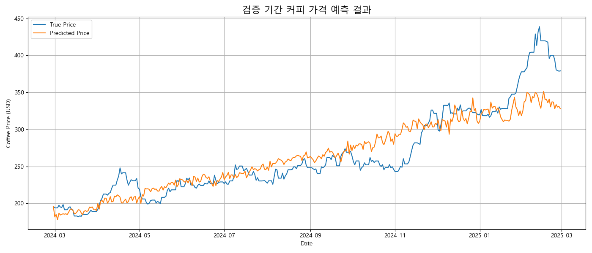
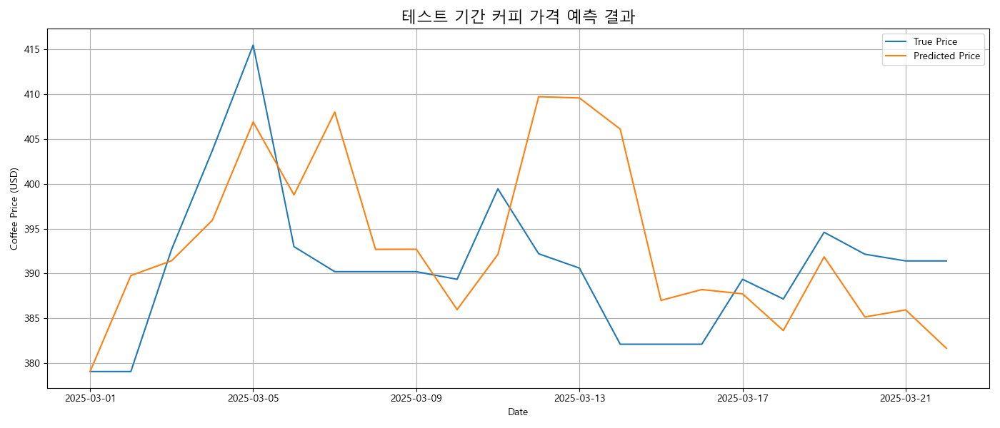

### 모델 학습 과정

-   train: 2015/01/02 - 2024/02/28
-   valid: 2024/02/29 - 2025/02/28
-   test: 2025/03/01 - 2025/03/23

test 데이터셋을 설정할 때, 3월1일이 오늘이라고 가정하여 lag feature와 범주형 데이터를 제외하고, 3월 2일부터 기후 데이터를 nan으로 설정하였다.(미래 기후는 수집을 못한다고 가정하였기 때문)

모델 학습 전, 많은 lag feature들이 존재하여 모델이 오히려 과적합이 될 수 있다고 생각되었다. 따라서 1, 3, 6 month lag feature만 남기고 2, 4 lag feature는 제외하였고, Random Forest 모델을 사용하여 학습을 진행하였다.

### Valid data 결과



```
>>> Valid RMSE : 26.12439
```

검증 데이터에서는 전반적인 상승 추세를 어느정도 따라가지만, 2025년 초의 급격한 가격 상승 구간에서는 실제 값 대비 반응이 둔감하며, 피크 구간에서 예측이 평탄화되는 현상이 나타났다.

이는 Random Forest의 평균화 특성 및 미래 예측에서 기후 데이터 부재로 인한 정보 부족의 영향을 받은 것으로 해석된다.

### Test data 결과



```
>>> Test RMSE : 9.81718
```

테스트 데이터에서는 시작 가격 정렬이 효과적으로 적용되어, 예측값이 실제 추세와 유사한 범위 내에서 움직이는 양상을 보였다.

그러나 일부 고점 및 저점의 시점이 어긋나는 구간이 존재하며, 이는 단기 변동성에 대한 민감도가 낮은 RandomForest의 구조적 한계로 판단된다.
